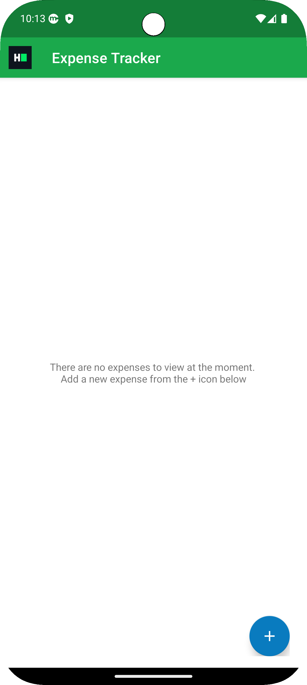

# HackerRank Kotlin Android - Swiggy SDE-1 Challenge

  
  

## 📱 Overview

This repository contains my implementation of an Expense Tracker Android application developed as part of Swiggy's Android Machine Coding interview challenge for an SDE-1 role, hosted on HackerRank. The application allows users to track and manage their expenses with features for adding, editing, and viewing expense records.

> **Note:** This repository demonstrates my solution to a code-fixing challenge. Swiggy provided a partially implemented project, and the task was to identify and fix specific issues in the codebase according to requirements.

## 📸 App Screenshots

  
   
  
  

## 📋 Challenge Description

This challenge was part of Swiggy's technical interview process for Android developers, administered through HackerRank's platform.

### Task
The challenge required fixing and implementing the Expense list screen in a partially completed Expense Tracker application. The focus was on proper UI implementation, state management, and data handling.

### Key Features Implemented
1. A functional list of expense items with proper state handling
2. Add new expense functionality via floating action button
3. Edit existing expense capability
4. Each expense item displays:
    - Description
    - Amount
    - Category
    - Edit button

## 🛠️ Problems and Solutions

The challenge provided a codebase with several non-functional components. Here's how I approached solving the key issues:

### ExpenseListFragment.kt

**Problems:**
- Incomplete `observeData()` method missing the LiveData consumption logic
- Missing UI state handling based on `ExpenseListStateEvent.UpdateExpenses` properties
- Incomplete `setupListeners()` method for navigating to Add Expense screen

**Solutions:**
- Implemented proper LiveData observation in `observeData()` to respond to state changes
- Added conditional UI logic to show/hide expense list based on data availability
- Fixed navigation to Add Expense screen through the `AddEditExpenseFragment`

### ExpensesViewModel.kt

**Problems:**
- Incomplete `updateView()` method lacking logic for UI state updates
- Missing implementation for `addExpense()` to handle adding new expenses
- Missing implementation for `editExpense()` to update existing expenses

**Solutions:**
- Implemented `updateView()` with proper state management:
    - Set `showList` flag based on list emptiness
    - Provided immutable list copy to ensure adapter triggers proper updates
- Added expense creation logic in `addExpense()` with LiveData publishing
- Implemented expense editing logic in `editExpense()` with proper state updates

### ExpensesAdapter.kt

**Problems:**
- Inefficient DiffUtil implementation causing issues with list updates
- Suboptimal item comparison logic

**Solutions:**
- Optimized DiffUtil implementation for efficient list diffing
- Enhanced item comparison logic to properly detect changes in expense objects
- Improved adapter efficiency for smoother list rendering

## 🧠 Technical Approach

My approach to solving this challenge:

1. **Analysis Phase**
    - Thoroughly examined the codebase to identify all incomplete implementations
    - Understood the data flow and architecture of the application
    - Created a roadmap of issues to address in priority order

2. **Implementation Strategy**
    - Maintained the existing MVVM architecture
    - Used LiveData for reactive UI updates
    - Followed Kotlin best practices
    - Ensured efficient list rendering
    - Handled UI state transitions properly

3. **Testing**
    - Verified each feature worked as expected
    - Tested edge cases (empty lists, data changes)
    - Ensured smooth UI transitions

## 💯 Code Quality Focus

Throughout my implementation, I maintained a focus on code quality through:

1. **Clean Code Practices**
    - Meaningful variable and function names
    - Single Responsibility Principle
    - Proper error handling

2. **Kotlin Best Practices**
    - Null safety with proper nullable type handling
    - Extension functions where appropriate
    - Idiomatic collection operations

3. **Efficient UI Updates**
    - Minimizing unnecessary redraws
    - Optimized DiffUtil implementation
    - Proper state management

4. **Architecture Adherence**
    - Maintaining clear separation of concerns (MVVM)
    - Unidirectional data flow
    - Proper LiveData usage

## 🚀 Technologies Used

- **Kotlin** - Primary programming language
- **MVVM Architecture** - For clean separation of concerns
- **LiveData** - For reactive UI updates
- **RecyclerView & DiffUtil** - For efficient list rendering
- **Material Design Components** - For modern UI elements

## 🧪 Additional Resources

The repository includes:

1. **MCQ Assessment**: Multiple-choice questions related to Android development concepts are available in the assets folder. These were part of the theoretical assessment component of the Swiggy interview process.

2. **Original Challenge Requirements**: The complete problem statement and requirements as provided in the HackerRank challenge.

## 📝 License

This project is available for educational purposes.

---

*This repository showcases my solution to Swiggy's Android Machine Coding challenge administered through HackerRank, demonstrating my problem-solving approach and Android development best practices.*